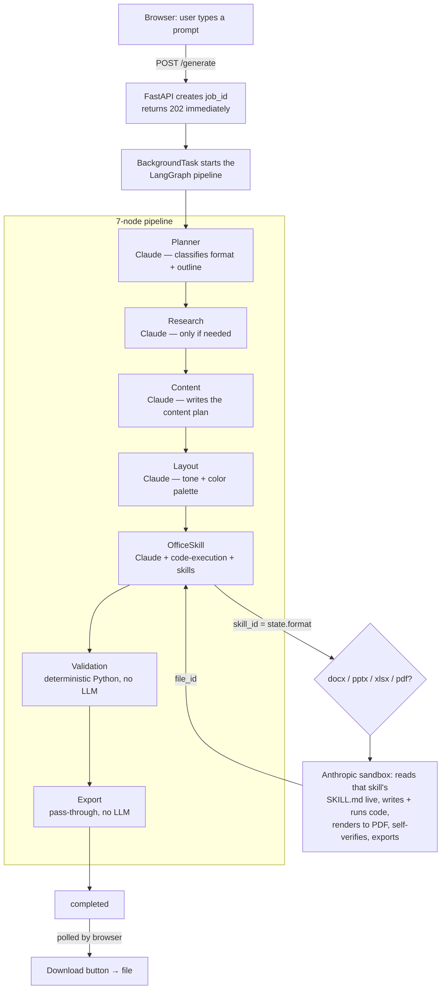

# AI Document Generation Platform

Turn a plain-English prompt into a real, validated `.docx`, `.pptx`, `.xlsx`, or `.pdf`
file — through a single web UI, with the format detected automatically.

```
prompt → Planner → Research → Content → Layout → OfficeSkill → Validation → Export → file
```

Built as a FastAPI + LangGraph pipeline around Anthropic's Messages API
`code-execution` + `skills` betas: Claude reads the relevant document skill's own
documentation, writes and runs real generation code, renders and visually checks its
own output, then hands back a file. Nothing here reimplements OOXML/PDF generation —
that logic stays inside the skills themselves.

## Quick start

```bash
pip install -r backend/requirements.txt
cp backend/.env.example backend/.env
# edit backend/.env, paste in a real ANTHROPIC_API_KEY (direct Anthropic key, not a gateway/proxy)

python app.py
```

Open `http://127.0.0.1:8000/`, type a request, click Generate. First real generation
takes a few minutes — see `RUNBOOK.md` for the full step-by-step guide, including what
to expect and how to read failures.

## Architecture



`POST /generate` returns a `job_id` immediately and runs this pipeline in the
background (generation takes real minutes); the UI polls `GET /jobs/{id}` for live
progress and downloads from `GET /jobs/{id}/download` once done.

Full diagrams (including the exact skill-selection branching), the request
lifecycle, and a table of what each node actually does:
**[`ARCHITECTURE.md`](ARCHITECTURE.md)**. Or explore it interactively — once the app
is running, open `http://127.0.0.1:8000/architecture` for a clickable version with a
live format/skill-detection demo.

## What's in this repo

- **`app.py`** — single entry point that starts the whole service.
- **`ARCHITECTURE.md`** — the complete orchestration flow: system diagram, request
  lifecycle, and per-node breakdown of what calls Claude vs. what's deterministic.
- **`INTEGRATION.md`** — how to call this as a service from another backend (API key
  auth, the 3 endpoints you need, a Dockerfile).
- **`Dockerfile`** — repo-root (not `backend/Dockerfile`) since the app needs
  `mnt/skills/*` alongside `backend/` at runtime. See `INTEGRATION.md`.
- **`backend/`** — the actual application: FastAPI app, the 7-node LangGraph pipeline,
  and the UI it serves. See `backend/README.md` for how each node works and what's
  genuinely built vs. explicitly out of scope.
- **`mnt/skills/public/`** — the document-generation skills themselves (docx, pptx,
  xlsx, pdf), each with a `SKILL.md` describing its documented workflow. **These carry
  an Anthropic proprietary license (see each skill's `LICENSE.txt`) that restricts
  redistribution and copying outside Anthropic's own Services** — know that before
  reusing this repo elsewhere.
- **`mnt/skills/private/ai-document-platform/`** — the custom orchestration skill
  (`SKILL.md`) plus the engineering rules and verified-behavior notes
  (`ENGINEERING_NOTES.md`) that the backend's OfficeSkill node is built on.
- **`tools/skills-api-test/`** — a standalone script that verifies the Messages API
  `code-execution`/`skills` call pattern directly, independent of the full backend.
- **`RUNBOOK.md`** — the step-by-step guide to running this end to end through the UI.

## Origins

The document-generation skills under `mnt/skills/public/` originate from
[Cam10001110101/claude-skills-base](https://github.com/Cam10001110101/claude-skills-base).
Everything else — the backend pipeline, orchestration skill, and UI — is original to
this project.
